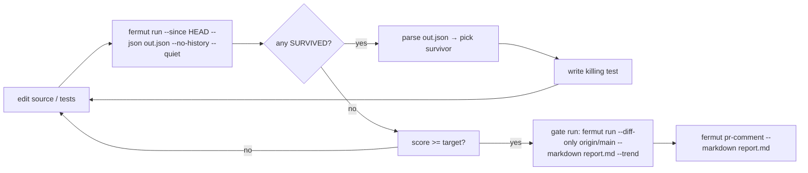

# Coding agents

fermut is built for **coding agents** as much as it is for humans. The
inner loop of mutation testing — write code, run mutants, read survivors,
write a killing test, re-run — matches the way agents already work:
short cycles, machine-readable output, deterministic results.

This page explains how to drive fermut from an agent (Claude, Cursor,
Aider, your own scaffolding) and which design decisions in fermut exist
specifically to make those loops fast and reliable.

## Why fermut works well for agents

| Need an agent has                                                          | What fermut gives it                                                                                                                              |
|----------------------------------------------------------------------------|---------------------------------------------------------------------------------------------------------------------------------------------------|
| Short iteration cycles (write → measure → write)                            | Per-mutant result cache keyed on `(mutant.id, ast_hash(file), scope)`. AST-structural hashing means reformat / comment edits don't invalidate. See [Cache strategy](#cache-strategy). |
| Machine-readable output                                                    | `--format json`, `--json <path>`, `--junit`, structured fields in every report writer.                                                            |
| Deterministic results across runs                                          | Pinnable Hypothesis seed, deterministic `--sample`, content-hash cache keys. Two runs of the same commit produce the same survivor list.            |
| Knowing *which test to write next*                                          | `fermut next` ranks survivors by cluster leverage + kill-ease and names the single best target; survivor JSON lines carry file:line, operator, original → replacement for the concrete assertion. |
| Knowing *if my work is helping*                                             | `.fermut/history.jsonl` + `fermut trend`. Score delta vs the previous iteration is the agent's reward signal.                                       |
| Targeting only the code the agent just touched                              | `--diff-only` for branch-relative diffs (three-dot, **committed** only), `--since <SPEC>` for "since I last ran" (two-dot, **includes uncommitted** edits). |
| Narrowing tests per mutant so each iteration runs in seconds, not minutes  | `--coverage coverage.json` (with per-test contexts).                                                                                                |
| Failing loud when the environment is broken                                 | `fermut doctor` returns exit code 1 with a remediation hint per failed check.                                                                       |

## One concrete cycle

End-to-end agent iteration on a Python repo. Each numbered step takes
seconds in steady state.

**1. Edit one file** — say `src/auth.py`, tightening a boundary check.

**2. Run fermut, write JSON** — `--since HEAD` scopes mutants to
just-edited files; cache reuses verdicts for everything else.

```sh
fermut run src/ --tests tests/ \
    --since HEAD \
    --coverage coverage.json \
    --json .fermut/last.json \
    --no-history --quiet
```

Stderr prints one progress line. Score and survivors land in
`.fermut/last.json`.

**3. Pick the next survivor** — agent parses JSON, sorts by operator,
takes the first.

```sh
jq '[.outcomes[] | select(.status == "survived")]
    | sort_by(.mutant.operator) | first | .mutant' .fermut/last.json
```

Returns:
```json
{ "id": "src/auth.py@812:boundary-shift:age >= 18->age > 18", "file": "src/auth.py",
  "line": 42, "operator": "boundary-shift",
  "original": "age >= 18", "replacement": "age > 18" }
```

The `id` grammar is `<file>@<byte-offset>:<operator>:<original>-><replacement>`.
**Caveat for agents that store ids across runs:** `<file>` is whatever path
fermut was invoked with — an absolute path when you run `fermut run /abs/src`
(the common case), so ids captured on one machine/checkout won't match another.
Don't persist ids as cross-machine keys; re-read them from each run's JSON, or
key your own state on the stable `file` + `line` + `operator` fields instead.

**4. Write a killing test** — agent opens `src/auth.py:42`, reads the
enclosing function, drops a test that asserts behavior at `age = 18`
exactly. Or asks `fermut explain --format json` for an operator-aware
hint + pytest skeleton.

**5. Re-run, watch the score delta** — only `auth.py`'s mutants
re-evaluate (cache hit on the rest). Boundary mutant moves from
`survived` → `killed`. `fermut trend --limit 2 --format json` shows
`+0.7 pts`.

Loop on step 1 until the score clears the target or every survivor
is justified as equivalent / acceptable. The whole cycle stays
under 10 seconds on warm cache for repos in the 500-mutant range.

## The recommended agent loop



Two distinct runs: the inner loop uses `--no-history --quiet` (iterations
are noisy, history is for the gate); the gate run drops those and adds
`--trend` + `--markdown` for the PR comment. Don't mix them.

Key invariants:

1. **Don't re-run the full sweep every iteration.** Use `--diff-only`
   (CI workflow) or `--since HEAD~1` (local), so the agent only burns
   wall-clock on lines it changed.
2. **Always read `out.json`, not stdout.** Stdout is for humans. JSON is
   stable across releases per the [versioning policy](https://github.com/KovantAI/fermut/blob/main/VERSIONING.md).
3. **Cache is the single biggest performance lever.** Default cache path
   `.fermut/cache.json` is the right answer — never disable it on the
   agent's primary loop. See below.
4. **Pin determinism.** Set `hypothesis_seed` in `fermut.toml`. Without
   it, Hypothesis-driven tests can mask or fabricate survivors between
   runs and the agent will chase ghosts.
5. **Regenerate coverage whenever tests change — not just once.**
   The coverage filter narrows tests per mutant from this file; a stale
   one silently mis-selects tests (mutants get `skipped (coverage …)` or
   the wrong tests run), shifting survivor counts with no error. Run
   `fermut coverage` at the top of any iteration that touched tests — it
   re-measures only the changed test files and writes a `.coverage`
   database fermut reads directly (`--coverage .coverage`). Or, manually:
   `pytest --cov … && coverage json …` for a `coverage.json` export. (The
   coverage file is gitignored in the sample — never commit it.)

## Cache strategy

The cache is what makes iterative use viable.

### How it works

After every successful mutant evaluation, fermut writes
`(mutant.id, ast_hash(source_file), scope) -> outcome` to
`.fermut/cache.json`. The file hash is **AST-structural** —
reformat / comment edits leave it untouched. `scope` is a hex digest
of the run-shape inputs (runner, timeout, hypothesis seed, pytest
args, coverage on/off), so a stale `survived` from a narrow
`--coverage` run can't poison a later full-suite run. On the next
`run`:

- For each mutant, fermut computes the current AST hash and the
  current run-shape `scope`.
- If `(mutant.id, current_ast_hash, current_scope)` matches a cached
  entry, the cached outcome is reused — no pytest invocation.
- If either component mismatches, the cache entry is ignored and the
  mutant re-runs.

See **[Caching concept](../concepts/caching.md)** for the full key
breakdown and the `cache_scope = "scope"` opt-in that narrows the
hash to the enclosing top-level def/class.

Result: an agent editing one file out of many only pays for mutants in
*that* file. Everything else is reused from cache.

### What's cached

| Outcome    | Cached?         | Why                                                                                  |
|------------|-----------------|--------------------------------------------------------------------------------------|
| killed     | :material-check:{ .yes }               | Behavior didn't change; rerunning the same test against the same patched bytes wastes time. |
| survived   | :material-check:{ .yes }               | Same.                                                                                |
| timed_out  | :material-check:{ .yes }               | Same.                                                                                |
| skipped    | :material-close:{ .no } (not cached)  | Skips come from the filter chain, which may change between runs (different `--ops`, `--coverage`, etc.). |
| errored    | :material-close:{ .no } (not cached)  | Errors are often transient (environment issues, flaky import).                       |

### When to clear it

`fermut clean` evicts the cache but **preserves `history.jsonl`** — so
agents lose iteration speed temporarily, but the trend log keeps its
continuity.

Clear it when:

- The agent upgrades fermut and the cache schema changes (the loader is
  forward-compatible — unknown fields are ignored — but stale entries
  may not exercise the new behavior).
- A flaky external dependency was fixed and you want survivors
  re-evaluated against the new state.
- You're debugging a "phantom survivor" that the agent can't reproduce
  by hand.

Don't clear it as a habit. The cache is the reason the inner loop is
fast.

### CI vs local cache

| Use case        | Cache path                                              | Persistence pattern                                                                                                                                            |
|-----------------|---------------------------------------------------------|----------------------------------------------------------------------------------------------------------------------------------------------------------------|
| Local agent loop | `.fermut/cache.json` (default)                           | Lives on the agent's working tree. Survives across iterations.                                                                                                  |
| CI / GHA         | `.fermut/cache.json` or `--cache-path .fermut/cache-shard-${i}.json` for sharded runs | Save & restore with `actions/cache` keyed on the source-tree hash. PRs inherit the latest `main` cache.                                                          |
| Distributed exec | One cache per shard, never shared                       | Shards are deterministic per `mutant.id`, but each shard's cache is independent.                                                                                |

A reasonable GHA setup for the agent's CI hook:

```yaml
- uses: actions/cache@27d5ce7f107fe9357f9df03efb73ab90386fccae  # v5.0.5
  with:
    path: .fermut/cache.json
    key: fermut-cache-${{ runner.os }}-${{ hashFiles('uv.lock', 'src/**/*.py', 'tests/**/*.py') }}
    restore-keys: |
      fermut-cache-${{ runner.os }}-
```

The key includes lockfile + sources because a dep change can invalidate
existing cache entries (different pytest version → different test
behavior).

## Trend tracking is the agent's feedback signal

`fermut trend` reads `.fermut/history.jsonl` and prints the per-run
table. For an agent, the useful comparison is **score delta vs the
previous iteration** — not the absolute score:

```sh
fermut trend --limit 3 --format json
```

```json
[
  {"timestamp":"…","mutation_score":78.0,"killed":39,"survived":11,…},
  {"timestamp":"…","mutation_score":82.0,"killed":41,"survived":9,…},
  {"timestamp":"…","mutation_score":85.7,"killed":24,"survived":4,…}
]
```

Two derived signals the agent should consume:

- **`history[-1].mutation_score - history[-2].mutation_score`** — did
  this iteration improve the suite?
- **`history[-1].survived - history[-2].survived`** — did the agent
  introduce *new* survivors? (Score can move up while survivor count
  also rises if the agent added killed mutants faster than survivors.)

Both signals are derived for you by **[`fermut score`](../reference/cli/score.md)** —
no jq, no hand-rolled history diff:

```sh
fermut score --format json
```

```json
{ "score": 85.7, "delta": 3.7, "baseline_score": 82.0,
  "new_survivors": [], "newly_killed": ["src/auth.py@812:…"],
  "regressed": false }
```

`regressed` is `true` when the score dropped or a previously-killed mutant
came back — the rollback trigger below, computed in the binary. Add
`--fail-on-regression <pts>` to make it exit non-zero for a CI / agent gate,
or `--baseline N` to compare against `N` runs back instead of the immediate
prior. Reach for the raw `trend` deltas only when you need the full window.

How to *act* on those deltas — a sketch for an agent's outer loop:

```python
# pseudocode for an agent's post-iteration check
delta = h[-1].mutation_score - h[-2].mutation_score
new_survivors = set(h[-1].survivor_ids) - set(h[-2].survivor_ids)

if delta < -0.5 or new_survivors:
    # Iteration made things worse or introduced new gaps.
    # Revert the last edit (git restore / agent rollback), then either
    # narrow scope (try one survivor instead of all) or escalate to a
    # human / a stronger model.
    revert_last_edit()
elif delta < 0.5:
    # Plateau. Same survivor set as last iteration — your last edit
    # didn't help. Try a different survivor before grinding the same
    # one again.
    pick_different_survivor()
else:
    # Progress. Commit, snapshot, continue.
    commit_iteration()
```

Pin `hypothesis_seed` and use the cache, otherwise the delta is noisy
and the rollback rule above fires on phantom regressions.

## Driving fermut programmatically

The recommended invocation for an agent inner loop:

```sh
fermut run src/ \
    --tests tests/ \
    --since HEAD                     # only mutants in just-edited files
    --coverage coverage.json         # narrow tests per mutant
    --json   .fermut/last.json       # parse this
    --no-history                     # iterations are noisy; gate the gate, not the loop
    --quiet                          # one line of progress in stderr at most
```

Once the agent decides to record progress (e.g. before committing), drop
`--no-history` and add `--trend` to the run that will produce the PR
report:

```sh
fermut run src/ --tests tests/ \
    --diff-only origin/main \
    --coverage coverage.json \
    --markdown report.md \
    --trend \
    --json    .fermut/last.json
```

### JSON size and context budget

Each outcome serializes to roughly 8 short fields — `mutant.id`,
file, line, operator, original, replacement, `range` (the mutated span
as `[start, end]` byte offsets — `start` is the `@N` in the id), plus
the `status` tag and (for skipped/equivalent/errored) one extra field. At default
formatting that is **~50–80 tokens per outcome** for an LLM-driven
agent feeding the JSON back into its context.

Rules of thumb on a typical repo:

| Mutants in report | Approx tokens (full JSON) | Strategy |
|------------------:|---------------------------|----------|
| ≤ 500             | ~25k                      | Feed the whole report; let the model pick the next survivor. |
| 500 – 5,000       | 25k – 250k                | Filter to `status == "survived"` first; most outcomes are `killed` and add no signal. |
| > 5,000           | > 250k                    | Don't read the JSON directly. Use `fermut show <selector>` or `fermut explain --format json <selector>` per survivor — small targeted reads, no context-window pressure. |

The least-effort path at any size is **[`fermut next --max-tokens N`](../reference/cli/next.md#token-budget)** —
it filters to survivors, ranks them, trims the fields, and fits the result
into a token budget, dropping the rest with a stderr note. No jq, no
manual field selection:

```sh
fermut next .fermut/last.json --max-tokens 2000
```

If you'd rather hand-filter — survivors only, with the fields the model
actually needs:

```sh
jq '[.outcomes[]
     | select(.status == "survived")
     | {id: .mutant.id, file: .mutant.file, line: .mutant.line,
        operator: .mutant.operator,
        original: .mutant.original, replacement: .mutant.replacement}]' \
    .fermut/last.json
```

That trims ~60% off the per-outcome token count and drops all
already-killed mutants entirely. Agents working in a 200k-context
window can fit roughly 3,000 filtered survivors using this shape.

### Parsing survivors from JSON

The report is `{ "summary": {...}, "outcomes": [...] }`. The `summary` object
carries the headline numbers so you don't have to re-derive them by counting
outcomes:

```json
{
  "summary": {
    "total": 158,
    "killed": 37,
    "survived": 8,
    "timed_out": 0,
    "skipped": 113,
    "equivalent": 0,
    "errored": 0,
    "mutation_score": 82.2
  },
  "outcomes": [ ... ]
}
```

Read the score directly:

```sh
jq '.summary.mutation_score' .fermut/last.json
```

The shape of one outcome:

```json
{
  "status": "survived",
  "mutant": {
    "id": "src/auth.py@812:boundary-shift:age >= 18->age > 18",
    "file": "src/auth.py",
    "line": 42,
    "operator": "boundary-shift",
    "original": "age >= 18",
    "replacement": "age > 18",
    "range": [812, 820]
  }
}
```

To pick the next survivor to address, prefer
**[`fermut next`](../reference/cli/next.md)** over a hand-rolled sort — it
ranks survivors by cluster leverage (one test *often* kills a whole
`(file, operator)` pattern — a heuristic, not a guarantee) then kill-ease,
and reports a score-gain range per cluster (`min` = kill the representative,
`max` = kill the whole cluster):

```sh
fermut next .fermut/last.json
```

```json
[ { "rank": 1, "id": "src/a.py@40:boundary-shift:>=->>",
    "file": "src/a.py", "line": 12, "operator": "boundary-shift",
    "cluster_size": 2, "ease": "high", "min_gain_pts": 25.0, "max_gain_pts": 50.0,
    "sibling_ids": ["src/a.py@60:boundary-shift:<=-><"] } ]
```

The raw equivalent — smallest operator first, no leverage weighting — if you
need to stay in `jq`:

```sh
jq '[.outcomes[] | select(.status == "survived")]
    | sort_by(.mutant.operator)
    | first
    | .mutant' .fermut/last.json
```

The agent then has enough context to:

1. Open `src/auth.py:42`.
2. Read the surrounding function.
3. Write a test that exercises the boundary case (`age = 18` exactly).
4. Re-run fermut. The cache means only `auth.py`'s mutants get
   re-evaluated; the new test catches `age >= 18` → `age > 18`, the
   mutant moves from `survived` to `killed`, the score climbs.

### Driving `explain` and `suggest` from agent loops

`fermut explain` and `fermut suggest` are the two subcommands that
exist specifically for in-loop agent consumption.

**Use `explain --format json` from inside an agent session.** It is a
pure heuristic pump — no network, no LLM cost — and emits a stable
`ExplainReport` shape that names file:line, enclosing symbol,
operator-specific hint, coverage signal, and a pytest skeleton. The
agent already has its own LLM context loaded with the repo; passing the
report through that context is cheaper and more accurate than asking a
second model. Reach for `--llm` only when the agent driver is *not*
itself an LLM (a shell script, a CI job).

```sh
fermut run src/ --tests tests/ --json out.json --no-history --quiet
# pick a survivor
fermut explain out.json <id> \
    --tests tests \
    --coverage coverage.json \
    --format json
# agent reads stdout, writes the killing test in its own session
```

**`fermut autofix` adds a verify loop on top of `suggest`** — it generates a
test, confirms it kills the mutant *and* keeps the suite green, and keeps
only proven tests (reverting the rest). For a non-LLM driver that wants
ready-to-commit results without a separate re-run, prefer `autofix
--all-survivors` over `suggest --apply`. See
**[`fermut autofix`](../reference/cli/autofix.md)**. (An LLM-driven agent
should still write its own test from `explain` — autofix's value is the
generate-and-verify automation, which a capable agent already provides by
calling `fermut run` after writing the test. Full rationale:
**[why no generation MCP tool](../reference/cli/mcp.md#no-generation-tools)**.)

**`fermut suggest` is the right tool when the driver is not an LLM.**
Shell scripts, CI jobs, or "fix all survivors in one shot" workflows
benefit from `suggest --all-survivors --apply --parallel N`. Each call
emits a single pytest function bound to the matching test file. The
generated tests need human review before merge — the model writes from
limited context and may reach for helpers that don't exist in your
project.

```sh
# Agent or CI: regenerate killing tests for every survivor in parallel,
# then re-run fermut to confirm.
fermut suggest .fermut/last.json \
    --all-survivors --apply --parallel 4 \
    --tests tests --format json > /tmp/suggest.json
fermut run src/ --tests tests/ --json .fermut/last.json
```

The `--format json` output preserves report order even under
`--parallel`, so downstream tooling can correlate `entries[i]` with the
i-th survivor.

`suggest` cost-controls:

- `--no-cache` is for prompt iteration only. The default cache at
  `.fermut/llm-cache.json` keys on `(mutant.id, sha256(file),
  sha256(prompt))` — re-runs against unchanged source are free.
- `--parallel N` shortens wall-clock but respects your tenant's rate
  limits when N is small. Default `1`.
- `--sample-count 0` cuts ~50% of prompt tokens at the cost of less
  style mimicry. Useful for very large test suites.

**Dollar-cost anchor.** A typical `suggest` call against
`claude-sonnet-4-6` runs ~3k input tokens (mutant + surrounding
source + sample tests) and ~600 output tokens (generated pytest
function). At current
[Anthropic pricing](https://www.anthropic.com/pricing) that lands
around **$0.01–$0.02 per call**. For a 50-survivor `--all-survivors`
run, budget roughly $0.50–$1.00 cold; warm re-runs against unchanged
source are **$0.00** (LLM cache hit). `--sample-count 0` halves the
input-token side, dropping cold cost by ~30%. Verify against your
own usage logs — Anthropic prices shift and your prompt shape may
differ.

### `fermut doctor` as a preflight

Before the first `run`, an agent should preflight:

```sh
fermut doctor --strict
```

This fails loud (exit 1) when the environment is misconfigured —
missing pytest, Python < 3.10, `coverage.json` lacks per-test contexts,
etc. — and prints a one-line remediation hint per failure. Better than
discovering the same problem ten mutants into a run.

Note the `hypothesis_seed` check is **conditional**: `doctor` only warns
about an unpinned seed when the project actually depends on Hypothesis
(pinning one otherwise is pointless), so a clean `doctor` on a non-Hypothesis
repo is expected — it isn't skipping the check.

## Anti-patterns

- **Disabling the cache.** `--no-cache` is for one-off debugging, not
  for the loop. Re-running every mutant every iteration is the dominant
  cost.
- **Re-running the full sweep every iteration.** Use `--since HEAD` or
  `--diff-only` so the cache hit ratio stays high.
- **Reading stdout instead of JSON.** Stdout formatting is human-tuned;
  no API guarantee. For `explain` / `suggest`, pass `--format json` —
  the schema is part of the versioned contract.
- **Letting `suggest` write to source without review.** `--apply`
  appends to your test files. Always diff before committing — the model
  may invent imports or helpers.
- **Calling `suggest` from inside an LLM-driven agent.** Doubles the
  LLM round-trip and loses the agent's repo context. Prefer
  `explain --format json` and let the agent write the test itself.
- **Ignoring `errored` outcomes.** Errors are not survivors but they
  *are* signal — the test suite has hidden side-effects on the source
  tree or a transient failure. Don't sweep them under the rug.
- **Touching `history.jsonl` between runs.** The trend log is the
  agent's reward signal; if the agent fiddles with it, the trend
  becomes meaningless.

## Recommended `fermut.toml` for an agent-driven repo

```toml
# Agent-driven mutation testing.
# Optimized for: fast cache hits, deterministic survivors, machine-readable output.

source_root = "src"
tests = "tests"
runner = "pytest"

# Cache is the iteration-speed lever. Never disable in the inner loop.
cache = true

# Trend log is the agent's reward signal. Append on every run.
history = true

# Determinism: same commit → same survivors → meaningful trend deltas.
hypothesis_seed = 12345

# Narrow ops to start. The agent can widen as the score climbs.
ops = ["arith-op-swap", "compare-op-swap", "boundary-shift", "return-value-to-none"]

# ty filter drops type-invalid mutants before they cost a pytest run.
ty_filter = true

# Per-mutant test selection. Big speedup once coverage.json exists.
coverage = "coverage.json"

# Keep timeouts tight in the inner loop — slow mutants slow the agent.
timeout = 15
```

Use `fermut init --profile pr-gate` to get a config close to this — then
hand-edit.
